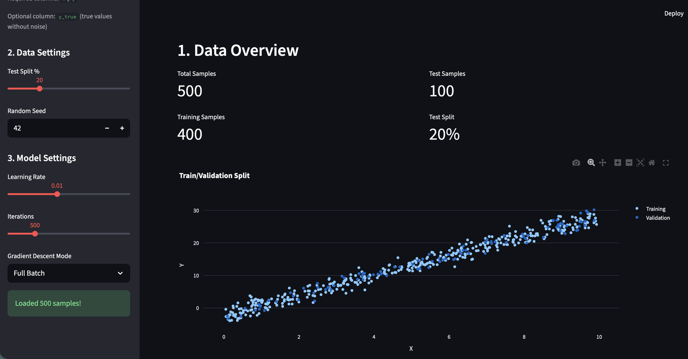
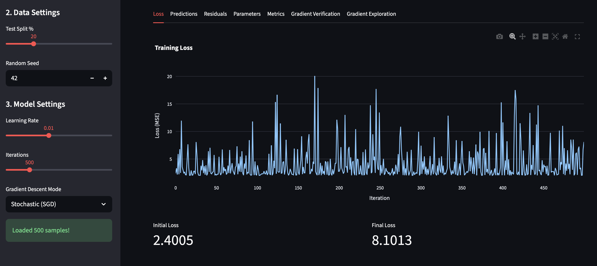
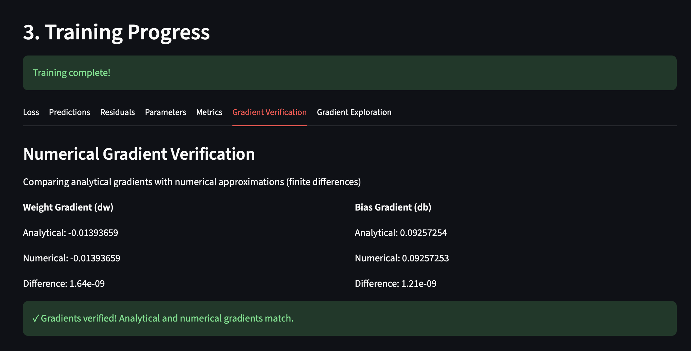
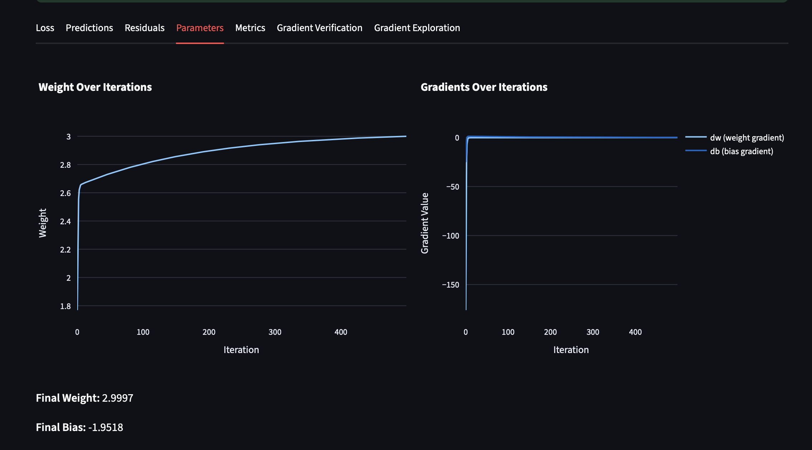
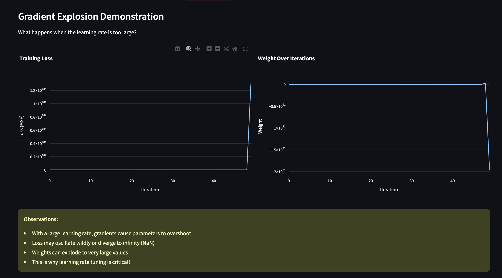

### Owen Lindsey & Tyler Friesen
### Professor Artzi
### Jan 21 2027
### AIT-204 
### Linear Regression

---

###  Part 1 Formula Application for Differentiation

**a. Interpret dy/dx geometrically:** 


dy/dx represents the slope of a tangent line to a curve at a specific point. 

In Linear Regression dy/dx shows how steep the loss function is at a particular point. when dy/dx is positive, the loss is trending upward or uphill. When negative the loss is decreasing or going downhill. If dy/dx is zero, we are at a flat point, potentially the minimum. 

The sign tells me which direction to move the weights, either left or right on the curve. The magnitude tells me how steep the slope is, larger values result in steeper slopes. 


<<<<<<< HEAD
=======

>>>>>>> 155dd84c15ca2d75fcb93fccfb22657a63382e0b


Source: [xaktly.com – The Derivative (Figure 9)](https://xaktly.com/TheDerivative.html)

---

**b. How many differentiation formulas do we have and what are they?** 

1. **Power Rule:**

	d/dx(x^n) = nx^(n-1)
	
		*(Bring down the exponent, reduce power by 1)*

2. **Constant:**

	 d/dx[c] = 0
	
		 *(Derivative of any constant is zero)*

3. **Constant Multiple:**

	 d/dx[cf(x)] = (c)df/dx
	
		 *(Pull the constant out front)*

4. **Sum Rule:**

	 d/dx[f + g] = f'(x) + g'(x)
	
		 *(Differentiate each term separately)*

5. **Product Rule:**

	d/dx[fg] = (f)dg/dx + (g)df/dx
	
		*(First times derivative of second, plus second times derivative of first)*

6. **Quotient Rule:**

	d/dx[f/g] = (g·df/dx - f·dg/dx) / g²
	
		*(Bottom times derivative of top, minus top times derivative of bottom, all over bottom squared)*

7. **Chain Rule:**

	 d/dx[f(g(x))] = f'(g(x)) * g'(x)
	
		 *(Derivative of outer function times derivative of inner function)*

8. **Exponential:**

	 d/dx[e^x] = e^x
	
		 *(e^x is its own derivative)*  
	

---
**c. Differentiate:** 

**Problem 1:**

**y = 4 + 2x - 3x^2 - 5x^3 - 8x^4 + 9x^5**

1. Apply the sum rule and differentiate each term separately

2. Constant term 

		d/dx[4] = 0

3. Linear term 

		d/dx[2x] = 2
	
4. Apply power rule to remaining terms
	
		d/dx[-3x^2] = -6x
		d/dx[-5x^3] = -15x^2
		d/dx[-8x^4] = -32x^3
		d/dx[9x^5] = 45x^4
	
5. Combine all terms

**Answer:** dy/dx = 2 - 6x -15x^2 - 32x3 + 45x^4

---
**Problem 2:**

**y = 1/x+3/x^2 + 2x^3 = x^(-1) + 3x^(-2) + 2x^(-3)**

1. Rewrite using negative exponents
	
		 This allows us to use the power rule 
	
2. Apply the power rule 
	
		 d/dx[x^n] = nx^n-1 
	
	 d/dx[x^-1] = -1 * x^-2 = -x^-2
	 
	 d/dx[3x^-2] = 3(-2)x^-3 = -6x^-3 
	 
	 d/dx[2x^-3] = 2(-3)x^-4 = -6x^-4
	  
3. Combine terms
	
	dy/dx = -x^-2 - 6x^-3 - 6x^-4 
	
4. Convert back to fractions (Optional but it looks nice)

**Answer:** dy/dx = -1/x^2 - 6/x^3 - 6/x^4 
 

---
**Problem 3:**

**y = ∛(3x^2)-1/√5x**

1. Rewrite with exponents:
	
     
	y = (3x²)^(1/3) - 1/(5x)^(1/2)
	
	y = 3^(1/3) · x^(2/3) - 1/(5^(1/2) · x^(1/2))
	
	y = 3^(1/3) · x^(2/3) - 5^(-1/2) · x^(-1/2)

3. Simplify:
   
	 y = 3^(1/3) · x^(2/3) - (1/√5) · x^(-1/2)

4. Apply power rule:
   
	dy/dx = 3^(1/3) · (2/3)x^(-1/3) - (1/√5) · (-1/2)x^(-3/2)
	
	dy/dx = (2/3) · 3^(1/3) · x^(-1/3) + (1/2√5) · x^(-3/2)

6. Combine and simplify:

**Answer:** dy/dx = (2 · ∛3)/(3x^(1/3)) + 1/(2√5 · x^(3/2))


---

**d. Define partial derivative**

A partial derivative measures the rate of change of a multivariable function 
with respect to one variable while holding all other variables constant. 

In linear regression, partial derivatives allow us to find how the loss 
function changes with respect to each individual parameter (like slope or 
intercept) independently, which tells us how to adjust each parameter to 
minimize the loss.

---

**e. Given the following functions find ∂z/∂x and ∂z/∂y**

**Problem 1:**

z = 2x² - 3xy + 4y²

1. Find ∂z/∂x: Treat y as a constant

	∂z/∂x = ∂/∂x[2x² - 3xy + 4y²]

	∂z/∂x = 4x - 3y + 0

	∂z/∂x = 4x - 3y

2. Find ∂z/∂y: Treat x as a constant

	∂z/∂y = ∂/∂y[2x² - 3xy + 4y²]

	∂z/∂y = 0 - 3x + 8y

	∂z/∂y = -3x + 8y

**Answer:** ∂z/∂x = 4x - 3y  and  ∂z/∂y = -3x + 8y

---

**Problem 2:**

z = x²/y + y²/x

1. Rewrite using negative exponents

	z = x²y⁻¹ + y²x⁻¹

	This allows us to use the power rule

2. Find ∂z/∂x: Treat y as a constant

	∂z/∂x = 2xy⁻¹ + y²(-1)x⁻²

	∂z/∂x = 2x/y - y²/x²

3. Find ∂z/∂y: Treat x as a constant

	∂z/∂y = x²(-1)y⁻² + 2yx⁻¹

	∂z/∂y = -x²/y² + 2y/x

**Answer:** ∂z/∂x = 2x/y - y²/x²  and  ∂z/∂y = -x²/y² + 2y/x

---

**Problem 3:**

z = e^(x² + xy)

1. Use chain rule for ∂z/∂x

	Let u = x² + xy, then z = eᵘ

	∂z/∂x = eᵘ · ∂u/∂x

	∂u/∂x = 2x + y

	∂z/∂x = e^(x²+xy) · (2x + y)

2. Use chain rule for ∂z/∂y

	Let u = x² + xy, then z = eᵘ

	∂z/∂y = eᵘ · ∂u/∂y

	∂u/∂y = x

	∂z/∂y = e^(x²+xy) · x

**Answer:** ∂z/∂x = (2x + y)e^(x²+xy)  and  ∂z/∂y = xe^(x²+xy)


---


###  Part 2 Linear Regression



Here you can see we have created a synthetic dataset that fits the linear regression model y = b + wx + ϵ.
We have included a controlled amount of noise (ϵ) to simulate real-world data scenarios.
The dataset has been plotted showing the relationship between (x) and (y) with noise included in our streamlit app.


Here you can see that we have randomly partitioned our data into a train and test set.
The randomness helps us avoid bias in the data.


The weight and bias of the linear regression model has been initialized using random values. The initial random guess
for these values should be easily reproducible since the random function has been seeded with the number 42.


This is the same image from the train test split, however here we are emphasizing the predictions made by the model
on their respective splits. The model appears to generalize its learnings well on the validation set.


This shows the Mean Squared Error for our linear regression model as it trains on the synthetic dataset over time.
We can see that the MSE falls very rapidly, this is primarily due to the fact that our data is highly linear and
does not have much noise. This was trained using a Full Batch method of Gradient Descent.




Here we can see the linear regression model using different methods of gradient descent. The first one is mini batch and the second image is stochastic. We can see that mini batch is a bit noisier than the full batch, but still results in a lower MSE than our starting.
However, stochastic is so noisy that we actually result in a higher MSE than we started with. Immediately what this tells me is that
the learning rate for the stochastic descent is too high for it to settle on a global/local minima.



Here you can see that we have calculated the weights and biases using both the numerical method (gradient descent) as well as the
analytical method (Gauss Markov Theorem). The numerical method matches very closely to what the analytical method says.



This is the gradient over time as we train the model. You can see that the gradient tunes towards the correct value (the analytical one)
very quickly because the synthetic dataset we used to train on is very simple. Even though we had 500 iterations the model finds the
correct parameters in the first handful of iterations.



Here is what happens when we increase the learning rate to an excessive amount. You'll notice in the graphs that we get a giant leap
in our MSE value, as well as wild swings in our weight values for the model. Large learning values allow the model to move more quickly
towards the correct solution, however it can also cause it to overshoot the ideal set of parameters because we don't have enough 
resolution in the step size to make the small adjustments the parameters need.

---

# Ethical Considerations

## Potential for bias in data generation affecting model fairness:
The bias exhibited by the model will be the same biases that we have when creating the dataset. For example if we were building
an ML model to determine insurance rates based on the likelihood of a break-in our model could be subject to bias if we do not
choose a random sample of housing and break-ins. If we picked only houses in Scottsdale for our dataset, our break-in prediction
could be artificially low.
## Ensuring data privacy when using real-world data:
when handling user data to train our models we need to be extremely careful on how we handle it. One important consideration is
scrubbing any Personally Identifiable Information (PII) from the data to protect user anonymity. If we fail to do this then
confidential user information could leak out of the model, especially if our model is available for public use (ex: ChatGPT)
Importance of model transparency and explainability:
## Responsible use of models to benefit society and minimize harm:
Just like any piece of technology, machine learning models can be used to help people, or it can be used to hurt people. When
putting a machine learning model into use we should always keep the human impact at the forefront of our mind. For example,
using a machine learning model to screen job application candidates without any kind of human oversight can result in a more
depersonalized job interview process, souring the job applicant. It could also have biases that would go unchecked without human
oversight, like only responding to candidates with an American sounding name.
## Mitigating negative impacts of prediction errors:
The primary mitigator of negative impacts of prediction is to get a dataset that most accurately represents the parent distribution.
The second best way to mitigate is to keep good metrics on how the model is performing in production, and actively monitoring it
to make sure that the model is performing as intended.

---

# Program flowchart (and code to generate flowchart using mermaid.js)

```
flowchart TD
    A[Start Application] --> B[Set Page Configuration]
    B --> C[Initialize Sidebar]
    C --> D[Show Welcome Screen]

    %% Sidebar Inputs
    C --> E[Upload CSV File]
    C --> F[Configure Data Settings]
    C --> G[Configure Model Settings]

    %% Upload Check
    E -->|No file| H[Show Warning and Example CSV]
    H --> Z[Wait for User Action]

    E -->|File uploaded| I[Load CSV Data]
    I -->|Invalid data| J[Display Error Message]
    J --> Z

    I -->|Valid data| K[Split Train and Test Data]
    K --> L[Display Data Overview]
    L --> M[Plot Train Test Split]

    %% Training
    M --> N{Train Button Clicked}
    N -->|No| Z
    N -->|Yes| O[Initialize Model with Random Weights]

    O --> P[Fit Model One Iteration]
    P --> Q[Plot Initial Predictions]

    Q --> R[Train Model with Gradient Descent]
    R --> S[Store Loss Weight and Gradient History]

    S --> T[Generate Train and Test Predictions]

    %% Results Tabs
    T --> U[Display Results Tabs]

    U --> U1[Loss Plot]
    U --> U2[Prediction Plots]
    U --> U3[Residual Plot]
    U --> U4[Weights and Gradients]
    U --> U5[Evaluation Metrics]
    U --> U6[Gradient Verification]
    U --> U7[Gradient Explosion Demo]

    %% Gradient Check
    U6 --> V{Gradients Match}
    V -->|Yes| W[Show Gradient Success Message]
    V -->|No| X[Show Gradient Warning Message]

    U7 --> Z[User Continues Interaction]
```


